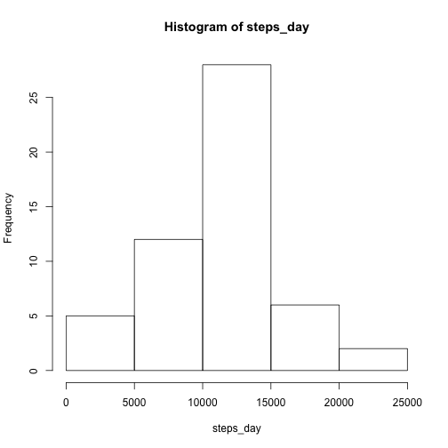
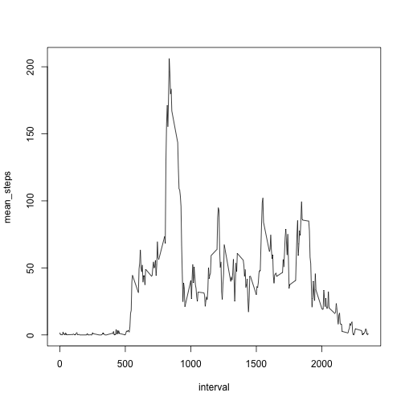
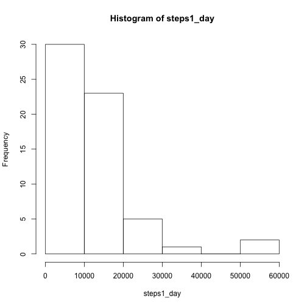
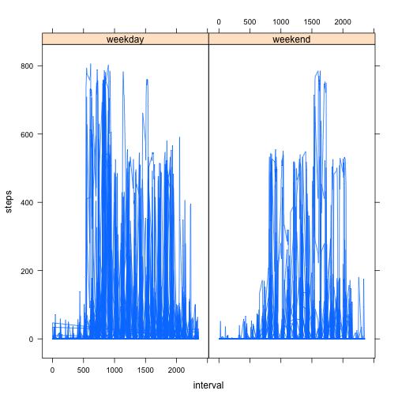

This is my R Markdown document for the 1st reproducible research assignment.

## Load and process the data  

1. Load packages  
2. Download and read the data


```r
##I'm using lubridate to do some of the date conversions
library(lubridate) 
library(lattice)

## Download, unzip and read in the dataset
## url <-"https://d396qusza40orc.cloudfront.net/repdata%2Fdata%2Factivity.zip"
## download.file(url, destfile = "act.zip")
## unzip("act.zip")

act <- read.csv("activity.csv", header = TRUE, stringsAsFactors = FALSE)
```

See what we have...


```r
## Check the dataset
dim(act)
```

```
## [1] 17568     3
```

```r
 summary(act)
```

```
##      steps            date              interval     
##  Min.   :  0.00   Length:17568       Min.   :   0.0  
##  1st Qu.:  0.00   Class :character   1st Qu.: 588.8  
##  Median :  0.00   Mode  :character   Median :1177.5  
##  Mean   : 37.38                      Mean   :1177.5  
##  3rd Qu.: 12.00                      3rd Qu.:1766.2  
##  Max.   :806.00                      Max.   :2355.0  
##  NA's   :2304
```

Next, convert the dates to date format 


```r
## use the ymd command from lubridate; add an extra column
 act$date1 <- ymd(act$date)
##check its worked
 
 str(act)
```

```
## 'data.frame':	17568 obs. of  4 variables:
##  $ steps   : int  NA NA NA NA NA NA NA NA NA NA ...
##  $ date    : chr  "2012-10-01" "2012-10-01" "2012-10-01" "2012-10-01" ...
##  $ interval: int  0 5 10 15 20 25 30 35 40 45 ...
##  $ date1   : POSIXct, format: "2012-10-01" "2012-10-01" ...
```

While we're here, add day of the week using wkday()


```r
## use the wkday command from lubridate; add an extra column
act$wkday <- wday(act$date1, label = TRUE)

 summary(act)
```

```
##      steps            date              interval          date1           
##  Min.   :  0.00   Length:17568       Min.   :   0.0   Min.   :2012-10-01  
##  1st Qu.:  0.00   Class :character   1st Qu.: 588.8   1st Qu.:2012-10-16  
##  Median :  0.00   Mode  :character   Median :1177.5   Median :2012-10-31  
##  Mean   : 37.38                      Mean   :1177.5   Mean   :2012-10-31  
##  3rd Qu.: 12.00                      3rd Qu.:1766.2   3rd Qu.:2012-11-15  
##  Max.   :806.00                      Max.   :2355.0   Max.   :2012-11-30  
##  NA's   :2304                                                             
##    wkday     
##  Sun  :2304  
##  Mon  :2592  
##  Tues :2592  
##  Wed  :2592  
##  Thurs:2592  
##  Fri  :2592  
##  Sat  :2304
```

## Calculate the mean steps per day  

Calculate steps per day and store to a new variable; plot histogram


```r
steps_day <- with(act, tapply(steps, date1, sum))
 
     hist(steps_day)
```

 

### Calculate mean and median steps over all days


```r
round(mean(steps_day, na.rm = TRUE),2);median(steps_day, na.rm = TRUE)
```

```
## [1] 10766.19
```

```
## [1] 10765
```
The mean steps per day was 1.076619 &times; 10<sup>4</sup>, and the median was 10765


### What is the average daily activity pattern?


```r
steps_int <- as.data.frame(cbind(unique(act$interval),with(act, tapply(steps, interval, mean, na.rm = TRUE))))
 colnames(steps_int) <- c("interval", "mean_steps")
 
   with(steps_int, plot(interval, mean_steps, type = 'l'))
```

 

### Which interval contains the max number of steps?


```r
which.max(steps_int$mean_steps)
```

```
## [1] 104
```
  The interval which conatins the maximum number of steps is 835.

 
## Impute missing data  
For this I am going to use the mean value for each interval to replace missing data. There are 3 steps  :

* Calculate the mean steps for each interval  
* Replace step NAs for each interval with the mean for that interval
* Combine this as a new field (needs to be unlisted). I have created a new data frame *act2*  


```r
act1 <- with(act, tapply(steps, interval, function(x) {ifelse(is.na(x), mean(x, na.rm = TRUE), x)}))
  act2 <- cbind(act, "imp_steps" = unlist(act1))
  str(act2)
```

```
## 'data.frame':	17568 obs. of  6 variables:
##  $ steps    : int  NA NA NA NA NA NA NA NA NA NA ...
##  $ date     : chr  "2012-10-01" "2012-10-01" "2012-10-01" "2012-10-01" ...
##  $ interval : int  0 5 10 15 20 25 30 35 40 45 ...
##  $ date1    : POSIXct, format: "2012-10-01" "2012-10-01" ...
##  $ wkday    : Ord.factor w/ 7 levels "Sun"<"Mon"<"Tues"<..: 2 2 2 2 2 2 2 2 2 2 ...
##  $ imp_steps: num  1.72 0 0 47 0 ...
```


```r
steps1_day <- with(act2, tapply(imp_steps, date1, sum))
  hist(steps1_day)
```

 


```r
summary(steps1_day)
```

```
##     Min.  1st Qu.   Median     Mean  3rd Qu.     Max. 
##    21.87   727.70 10310.00 10770.00 15020.00 50820.00
```

The distribution is now skewed, and the mean is 1.0766 &times; 10<sup>4</sup> and median 1.0311 &times; 10<sup>4</sup>. Using this method of imputation, the mean is unchanged but the median has fallen.


### Weekend activity

Finally, create a new variable *weekend* and use the lattice package to plot the data conditioned on weekend


```r
  act2$wend <- with(act2, ifelse(wkday == "Sat"| wkday == "Sun", "weekend","weekday"))
```
 

```r
  xyplot(steps ~ interval|wend,data = act2, lty=1, type = "l")
```

 
